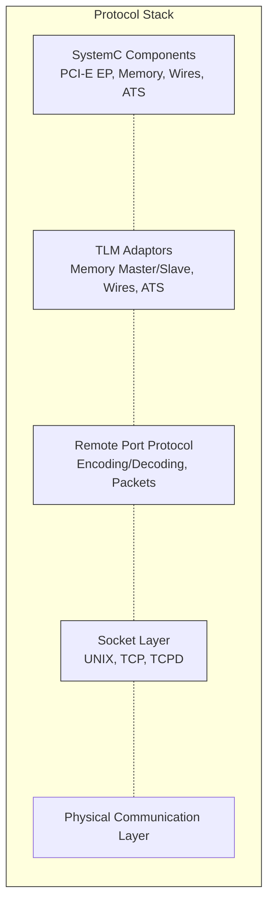
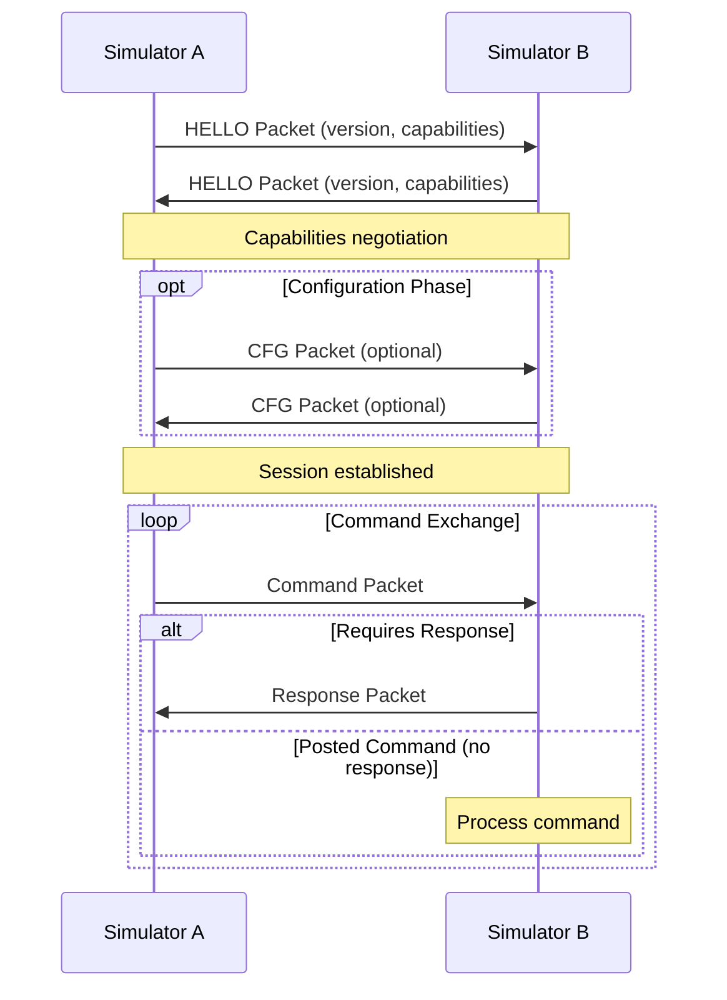
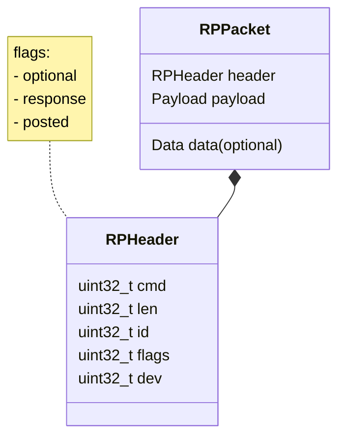
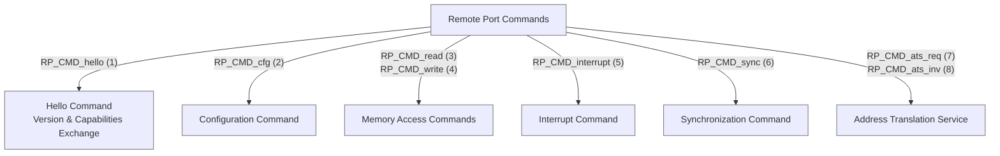
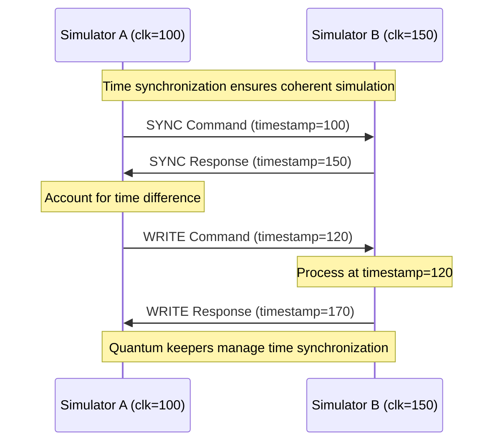
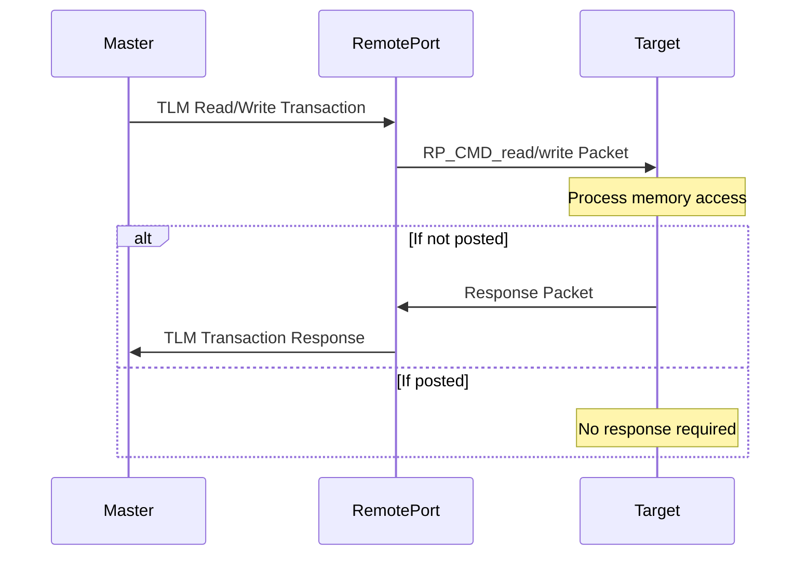
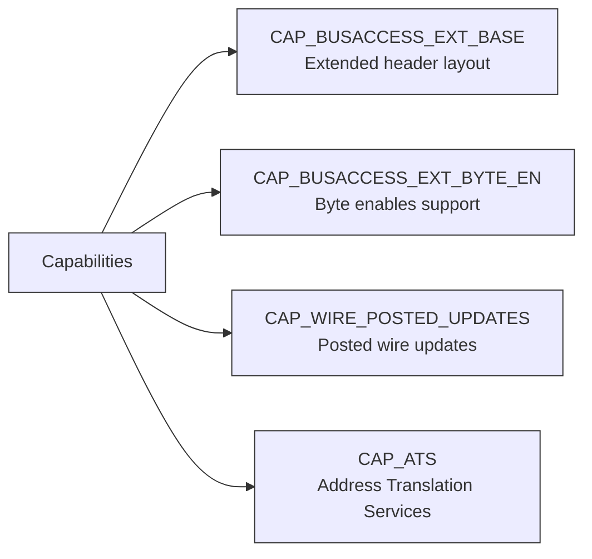
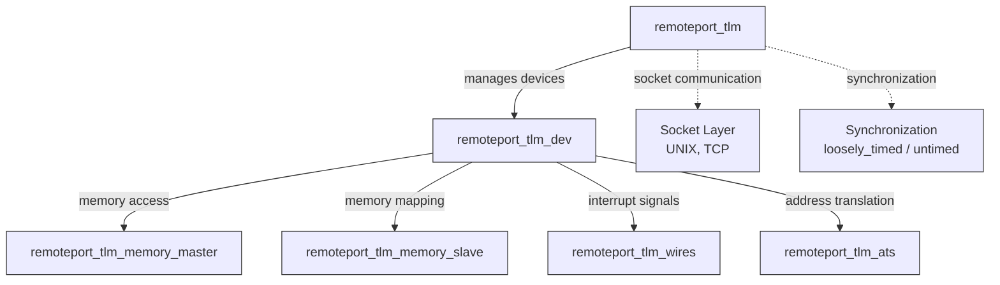
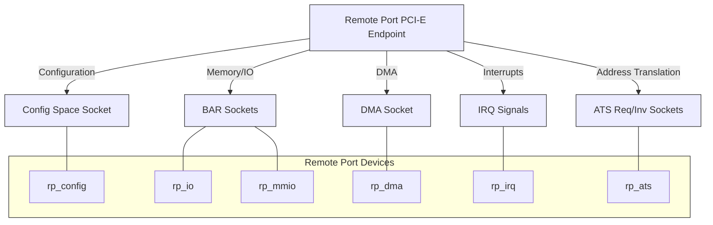

# Remote Port Protocol

Remote-Port (RP) is an inter-simulator protocol that enables communication between different simulation environments. It provides a reliable point-to-point communication channel between simulators, allowing them to exchange commands and data.

## Protocol Overview

<em>Figure 1: Remote Port Protocol Communication Stack</em>

## Communication Flow

<em>Figure 2: Remote Port Session Establishment</em>

## Packet Structure

<em>Figure 3: Remote Port Packet Format</em>

## Key Commands & Data Flow

<em>Figure 4: Remote Port Command Types</em>

## Synchronization Model

<em>Figure 5: Synchronization Between Simulators</em>

## Bus Access Protocol

<em>Figure 6: Memory Access Command Flow</em>

## Capabilities and Extensions

The Remote Port protocol supports various capabilities that can be negotiated during the HELLO packet exchange:

<em>Figure 7: Remote Port Capabilities</em>

## Implementation Architecture

<em>Figure 8: Remote Port Component Architecture</em>

## Protocol Use Case: PCI-E Device

<em>Figure 9: Remote Port PCI-E Endpoint Example</em>

## Protocol Version and Compatibility

The Remote Port protocol uses a versioning scheme with major and minor version numbers. The current protocol version is 4.3.

- Major version changes indicate backward-incompatible modifications
- Minor version changes indicate backward-compatible additions

Simulators must exchange and verify version compatibility during the HELLO packet exchange.